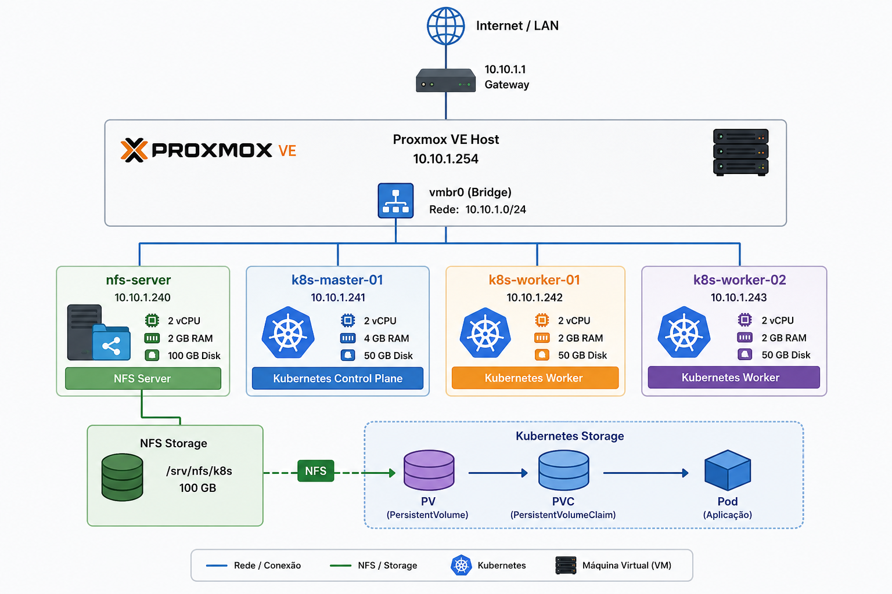

# Homelab Proxmox VMs

Laboratório de infraestrutura virtual desenvolvido com **Proxmox VE**, **Ubuntu Server** e **NFS**.

Este projeto tem como objetivo criar uma infraestrutura virtual reproduzível para estudos práticos de **Linux, virtualização, redes, armazenamento, infraestrutura e Kubernetes**.

A infraestrutura criada neste projeto será utilizada posteriormente pelo projeto:

**Homelab Kubernetes**

---

## 📋 Objetivo

Construir uma infraestrutura de laboratório utilizando Proxmox VE, composta por:

* 1 servidor NFS
* 1 Kubernetes Control Plane
* 2 Kubernetes Worker Nodes

O ambiente foi dimensionado para um servidor físico com recursos limitados, permitindo estudar Kubernetes em um ambiente real de laboratório.

---

## 🏗️ Arquitetura

```text
                         Internet / LAN
                              |
                         10.10.1.1
                           Gateway
                              |
                    ┌───────────────────┐
                    │    Proxmox VE     │
                    │    10.10.1.254    │
                    │                   │
                    │      vmbr0        │
                    └─────────┬─────────┘
                              |
             ┌────────────────┼────────────────┐
             |                |                |
             ▼                ▼                ▼
      ┌─────────────┐ ┌─────────────┐ ┌─────────────┐
      │ NFS Server  │ │ K8s Master  │ │ K8s Workers │
      │             │ │             │ │             │
      │ 10.10.1.240 │ │ 10.10.1.241 │ │ 10.10.1.242 │
      │             │ │             │ │ 10.10.1.243 │
      │ 2 vCPU      │ │ 2 vCPU      │ │ 2 vCPU      │
      │ 2 GB RAM    │ │ 4 GB RAM    │ │ 2 GB RAM    │
      │ 100 GB      │ │ 50 GB       │ │ 50 GB       │
      └──────┬──────┘ └─────────────┘ └─────────────┘
             |
             ▼
        NFS Storage
             |
             ▼
      Kubernetes PV/PVC
```

### Diagrama visual



---

## 🖥️ Hardware do Host

O laboratório está hospedado em um servidor físico com:

| Recurso     | Configuração                     |
| ----------- | -------------------------------- |
| Processador | Intel Xeon E3-1226 v3 @ 3.30 GHz |
| Sockets     | 1                                |
| Cores       | 4                                |
| Threads     | 4                                |
| Memória RAM | 16 GB                            |
| Swap        | 8 GB                             |
| Disco 1     | Kingston SA400S37120G - 120 GB   |
| Disco 2     | Samsung SSD 860 EVO - 500 GB     |

### CPU

O servidor possui **4 cores físicos e 4 threads**.

As máquinas virtuais utilizam atualmente:

```text
k8s-master-01    2 vCPU
k8s-worker-01    2 vCPU
k8s-worker-02    2 vCPU
nfs-server       2 vCPU
-----------------------
Total             8 vCPU
```

Isso representa um overcommit de CPU de:

```text
8 vCPU / 4 cores = 2:1
```

O overcommit é intencional e adequado ao objetivo educacional do laboratório.

---

## 🔧 Proxmox VE

Versões utilizadas:

| Componente  | Versão      |
| ----------- | ----------- |
| Proxmox VE  | 9.1.0       |
| PVE Manager | 9.1.14      |
| Kernel      | 7.0.2-4-pve |
| QEMU/KVM    | 11.0.0-2    |
| ZFS         | 2.4.2-pve1  |
| Ceph        | 19.2.3-pve2 |

Para verificar as versões:

```bash
pveversion -v
```

---

## 🌐 Rede

A infraestrutura utiliza a rede local:

```text
10.10.1.0/24
```

| Componente           | Endereço       |
| -------------------- | -------------- |
| Rede                 | `10.10.1.0/24` |
| Gateway              | `10.10.1.1`    |
| Proxmox              | `10.10.1.254`  |
| Bridge               | `vmbr0`        |
| NFS Server           | `10.10.1.240`  |
| Kubernetes Master    | `10.10.1.241`  |
| Kubernetes Worker 01 | `10.10.1.242`  |
| Kubernetes Worker 02 | `10.10.1.243`  |

### Bridge

```text
nic0
  |
  ▼
vmbr0
  |
  ├── NFS Server
  ├── Kubernetes Master
  ├── Kubernetes Worker 01
  └── Kubernetes Worker 02
```

---

## 💻 Máquinas Virtuais

| VMID | Hostname        | Função                   |    CPU |  RAM |  Disco | IP            |
| ---: | --------------- | ------------------------ | -----: | ---: | -----: | ------------- |
|  191 | `k8s-master-01` | Kubernetes Control Plane | 2 vCPU | 4 GB |  50 GB | `10.10.1.241` |
|  201 | `k8s-worker-01` | Kubernetes Worker        | 2 vCPU | 2 GB |  50 GB | `10.10.1.242` |
|  202 | `k8s-worker-02` | Kubernetes Worker        | 2 vCPU | 2 GB |  50 GB | `10.10.1.243` |
|  210 | `nfs-server`    | NFS Server               | 2 vCPU | 2 GB | 100 GB | `10.10.1.240` |

### Recursos alocados

```text
CPU:
8 vCPU

Memória:
10 GB

Storage:
250 GB
```

O host possui 16 GB de RAM, mantendo aproximadamente 6 GB disponíveis para o Proxmox VE e demais serviços.

---

## 💾 Storage

As máquinas virtuais são armazenadas no pool ZFS:

```text
zfs-s001
```

Distribuição:

| VM              |      Disco |
| --------------- | ---------: |
| `k8s-master-01` |      50 GB |
| `k8s-worker-01` |      50 GB |
| `k8s-worker-02` |      50 GB |
| `nfs-server`    |     100 GB |
| **Total**       | **250 GB** |

O servidor NFS utiliza sua VM para fornecer armazenamento compartilhado ao futuro cluster Kubernetes.

---

## 📦 NFS

O servidor NFS:

```text
Hostname: nfs-server
IP:       10.10.1.240
Storage:  100 GB
```

Export configurado:

```text
/srv/nfs/k8s
```

Rede autorizada:

```text
10.10.1.0/24
```

Configuração utilizada:

```text
/srv/nfs/k8s 10.10.1.0/24(rw,sync,no_subtree_check,no_root_squash)
```

O NFS será utilizado posteriormente como backend de armazenamento persistente para o Kubernetes.

### Validação do NFS

O NFS foi validado com sucesso pelos três nós Kubernetes:

| Nó              | IP            | Conectividade | Export | Montagem | Escrita | Leitura | Desmontagem |
| --------------- | ------------- | :-----------: | :----: | :------: | :-----: | :-----: | :---------: |
| `k8s-master-01` | `10.10.1.241` |       ✅       |    ✅   |     ✅    |    ✅    |    ✅    |      ✅      |
| `k8s-worker-01` | `10.10.1.242` |       ✅       |    ✅   |     ✅    |    ✅    |    ✅    |      ✅      |
| `k8s-worker-02` | `10.10.1.243` |       ✅       |    ✅   |     ✅    |    ✅    |    ✅    |      ✅      |

O teste validou:

* Conectividade com o servidor NFS
* Export `/srv/nfs/k8s`
* Montagem do compartilhamento
* Escrita de arquivos
* Leitura de arquivos
* Desmontagem

---

## ⚙️ Configuração das VMs

As máquinas virtuais utilizam:

* CPU `host`
* Controladora `virtio-scsi-single`
* Disco VirtIO SCSI
* Interface de rede VirtIO
* Bridge `vmbr0`
* QEMU Guest Agent
* Memory Ballooning desabilitado
* Discard habilitado
* I/O Thread habilitado
* Firewall da interface habilitado

Validação do QEMU Guest Agent:

```bash
qm agent 191 ping
qm agent 201 ping
qm agent 202 ping
qm agent 210 ping
```

---

## 🐧 Sistema Operacional

As máquinas virtuais utilizam:

```text
Ubuntu Server
```

ISO utilizada:

```text
ubuntu-26.04-live-server-amd64.iso
```

---

## 🔧 Scripts

Os scripts utilizados para criação e preparação da infraestrutura estão organizados em:

```text
scripts/
├── create-vm.sh
├── configure-network.sh
├── configure-hosts.sh
├── install-packages.sh
├── configure-nfs.sh
├── test-nfs.sh
└── check-vms.sh
```

### `create-vm.sh`

Responsável pela criação das máquinas virtuais no Proxmox utilizando `qm`.

### `configure-network.sh`

Configura o endereço IP estático das VMs utilizando Netplan.

Exemplo:

```bash
sudo ./configure-network.sh 10.10.1.241
```

### `configure-hosts.sh`

Configura a resolução de nomes entre os nós através do `/etc/hosts`.

```text
10.10.1.241 k8s-master-01
10.10.1.242 k8s-worker-01
10.10.1.243 k8s-worker-02
10.10.1.240 nfs-server
```

### `install-packages.sh`

Instala ferramentas básicas utilizadas durante a preparação das VMs, incluindo:

* curl
* wget
* git
* vim
* nano
* htop
* ping
* DNS utilities
* traceroute
* chrony
* QEMU Guest Agent

### `configure-nfs.sh`

Automatiza a configuração do servidor NFS:

* Instalação dos pacotes NFS
* Criação do diretório `/srv/nfs/k8s`
* Configuração do `/etc/exports`
* Aplicação dos exports
* Inicialização do serviço NFS
* Validação da configuração

### `test-nfs.sh`

Realiza testes completos do NFS:

* Conectividade
* Resolução do hostname
* Export
* Montagem
* Escrita
* Leitura
* Desmontagem

### `check-vms.sh`

Realiza a validação das VMs diretamente no Proxmox utilizando o QEMU Guest Agent.

Exemplo:

```text
==================================================================
                 HOMELAB PROXMOX - VMs
==================================================================
VMID     HOSTNAME               STATUS       IP
------------------------------------------------------------------
191      k8s-master-01          running      10.10.1.241
201      k8s-worker-01          running      10.10.1.242
202      k8s-worker-02          running      10.10.1.243
210      nfs-server             running      10.10.1.240
==================================================================
```

---

## 🌐 Validação da Rede

A comunicação entre os nós foi validada utilizando hostname e endereço IP.

```bash
ping -c 2 k8s-master-01
ping -c 2 k8s-worker-01
ping -c 2 k8s-worker-02
ping -c 2 nfs-server
```

A resolução dos hosts pode ser validada com:

```bash
getent hosts k8s-master-01
getent hosts k8s-worker-01
getent hosts k8s-worker-02
getent hosts nfs-server
```

---

## 📊 Monitoramento do Host

### CPU

```bash
lscpu
```

### Memória

```bash
free -h
```

### Discos

```bash
lsblk -d -o NAME,SIZE,MODEL
```

### Storage Proxmox

```bash
pvesm status
```

### ZFS

```bash
zpool status
zpool list
zfs list
```

### VMs

```bash
qm list
```

---

## 📁 Estrutura do Projeto

```text
homelab-proxmox-vms/
│
├── README.md
│
├── diagrams/
│   └── homelab-architecture.png
│
├── docs/
│   ├── architecture.md
│   └── network.md
│
├── scripts/
│   ├── create-vm.sh
│   ├── configure-network.sh
│   ├── configure-hosts.sh
│   ├── install-packages.sh
│   ├── configure-nfs.sh
│   ├── test-nfs.sh
│   └── check-vms.sh
│
└── .gitignore
```

---

## 🗺️ Roadmap

### Infraestrutura Proxmox

* [x] Instalação do Proxmox VE
* [x] Configuração da rede `vmbr0`
* [x] Configuração do storage ZFS
* [x] Criação das máquinas virtuais
* [x] Configuração de CPU e memória
* [x] Configuração dos discos
* [x] Configuração da rede virtual
* [x] Instalação do Ubuntu Server
* [x] Configuração dos IPs estáticos
* [x] Instalação dos pacotes básicos
* [x] Instalação do QEMU Guest Agent
* [x] Configuração do `chrony`
* [x] Configuração do `/etc/hosts`
* [x] Testes de conectividade entre as VMs
* [x] Script de validação das VMs
* [x] Diagrama da arquitetura

### NFS

* [x] Instalação do NFS Server
* [x] Criação do `/srv/nfs/k8s`
* [x] Configuração do `/etc/exports`
* [x] Exportação do storage
* [x] Teste no `k8s-master-01`
* [x] Teste no `k8s-worker-01`
* [x] Teste no `k8s-worker-02`
* [x] Validação de escrita e leitura
* [x] Validação de montagem e desmontagem

### Kubernetes

A instalação do Kubernetes será realizada em um projeto separado.

* [ ] Preparação dos nós
* [ ] Instalação do containerd
* [ ] Configuração do kernel
* [ ] Configuração do sysctl
* [ ] Instalação do kubeadm
* [ ] Instalação do kubelet
* [ ] Instalação do kubectl
* [ ] Inicialização do Control Plane
* [ ] Adição dos Workers
* [ ] Instalação do CNI
* [ ] Configuração do MetalLB
* [ ] Integração com NFS
* [ ] Persistent Volumes
* [ ] Persistent Volume Claims

---

## 🔗 Projeto Kubernetes

Após a conclusão da infraestrutura, será utilizado o projeto:

```text
homelab-kubernetes
```

Esse projeto será responsável pela instalação e configuração do cluster Kubernetes.

Componentes planejados:

```text
Kubernetes
├── kubeadm
├── kubelet
├── kubectl
├── containerd
├── CNI
├── MetalLB
├── NFS Storage
├── Persistent Volumes
├── Persistent Volume Claims
├── Ingress Controller
└── Aplicações
```

---

## 🎯 Objetivos de Aprendizado

Este laboratório tem como objetivo desenvolver conhecimentos práticos em:

* Linux
* Proxmox VE
* Virtualização
* Redes
* TCP/IP
* Storage
* ZFS
* NFS
* Containers
* Kubernetes
* Kubernetes Networking
* MetalLB
* Persistent Volumes
* Infrastructure as Code
* Git
* GitHub
* DevOps

O objetivo não é apenas criar as máquinas virtuais, mas entender cada etapa da construção da infraestrutura, automatizar tarefas repetitivas e manter todo o processo documentado.

---

## 📌 Status

🟢 **Infraestrutura Proxmox + VMs + NFS concluída**

A infraestrutura possui atualmente:

```text
Proxmox VE
    │
    ├── k8s-master-01
    │      10.10.1.241
    │      2 vCPU / 4 GB RAM
    │
    ├── k8s-worker-01
    │      10.10.1.242
    │      2 vCPU / 2 GB RAM
    │
    ├── k8s-worker-02
    │      10.10.1.243
    │      2 vCPU / 2 GB RAM
    │
    └── nfs-server
           10.10.1.240
           2 vCPU / 2 GB RAM
```

Recursos totais alocados:

```text
8 vCPU
10 GB RAM
250 GB Storage
```

### NFS

O NFS Server está configurado e foi validado com sucesso pelos três nós Kubernetes.

```text
NFS Server
10.10.1.240
    │
    ├── k8s-master-01  ✅
    ├── k8s-worker-01  ✅
    └── k8s-worker-02  ✅
```

A infraestrutura está pronta para a próxima fase:

**Preparação e instalação do cluster Kubernetes.**

---

## 📄 Licença

Este projeto foi desenvolvido para fins de estudo, laboratório e aprendizado prático de infraestrutura, virtualização, Linux e Kubernetes.


